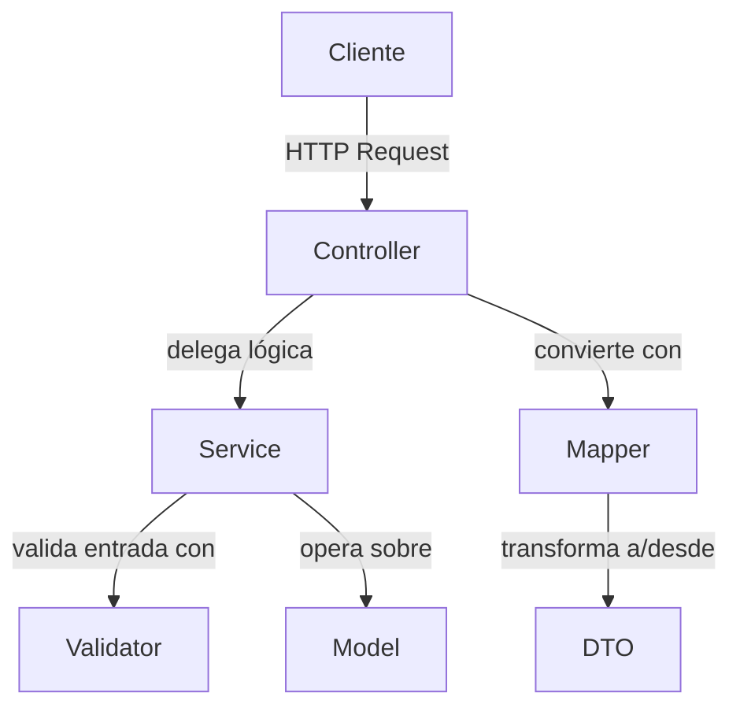
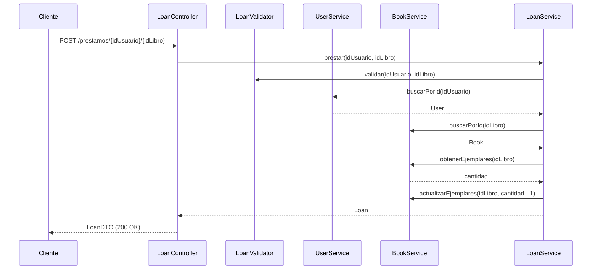
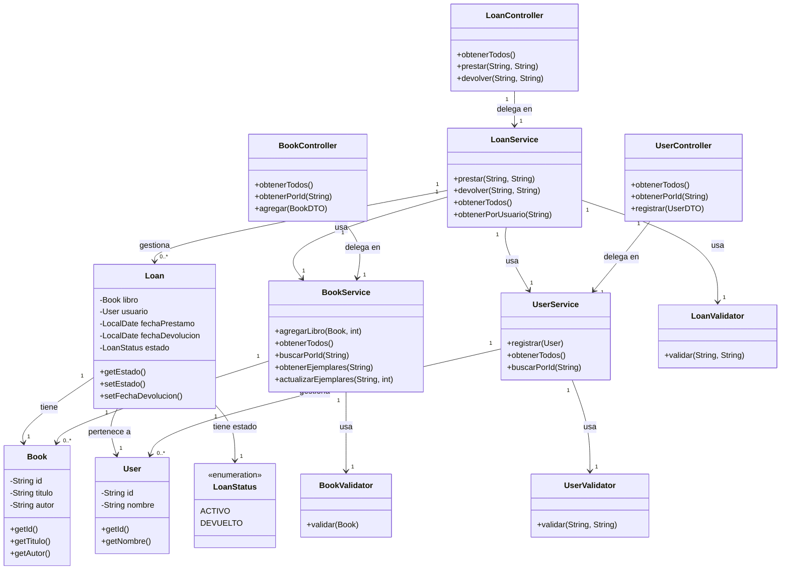

# DOSW-Library

Sistema de gestión de biblioteca desarrollado con Spring Boot y Maven. Permite registrar usuarios, agregar libros con sus ejemplares disponibles, realizar préstamos y registrar devoluciones.

---

## Diagrama General

el sistema se divide en capas. el cliente manda peticiones HTTP que llegan a los controladores, cada controlador le pasa el trabajo al servicio que le corresponde. los servicios usan los validadores para revisar que los datos esten bien antes de tocar los modelos. los controladores usan los mappers para convertir entre los modelos internos y los DTOs que ve el cliente.

---

## Diagrama Específico

aca se ve paso a paso como funciona un prestamo. el cliente llama al `LoanController` con el id del usuario y el libro, ese le pasa la tarea al `LoanService`. el servicio valida los ids, busca el usuario y el libro, revisa que haya ejemplares disponibles y que el usuario no tenga mas de 3 prestamos activos. si todo esta bien le resta un ejemplar al libro y registra el prestamo, al final le devuelve un `LoanDTO` al cliente.

---

## Diagrama de Clases

aca estan todas las clases del sistema con sus atributos, metodos y como se relacionan entre ellas. `Loan` es la clase mas importante porque conecta un `Book` con un `User` y guarda el estado del prestamo con `LoanStatus`. los servicios manejan las listas de cada entidad y cada uno tiene su validador. los controladores solo reciben la peticion HTTP y se la pasan al servicio.

---

## Análisis estático con SonarCloud

Resultado del análisis estático del proyecto en SonarCloud.

## Evidencia de pruebas

### Pruebas unitarias

### Cobertura JaCoCo

---

## Evidencia de pruebas funcionales

### Agregar libro

### Agregar usuario

### Obtener todos los libros

### Prestar libro

### Devolver libro

