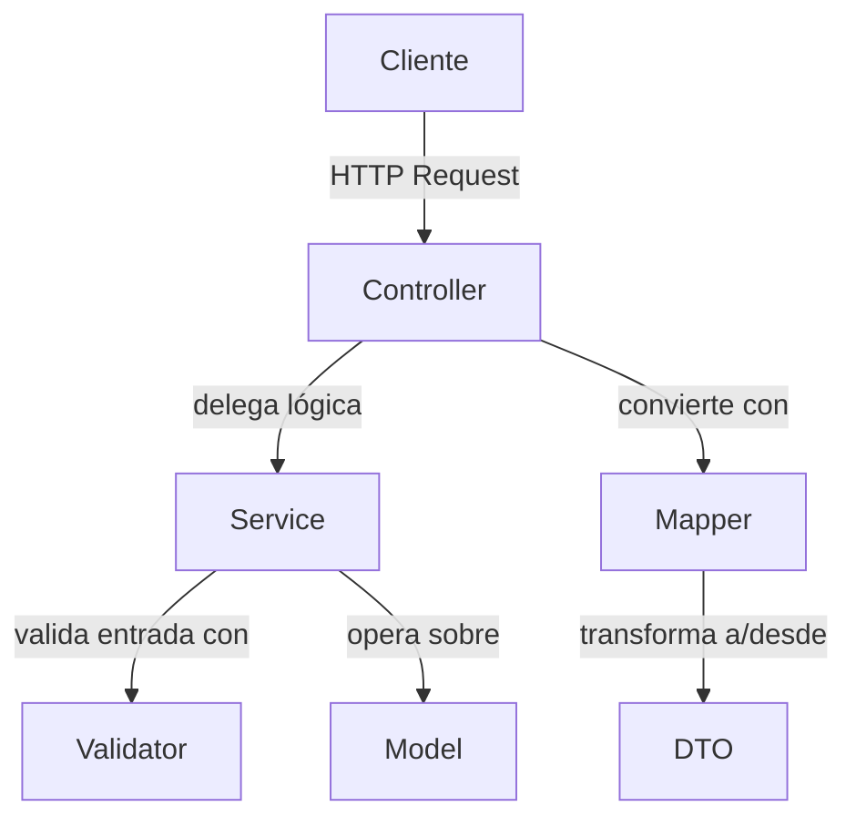
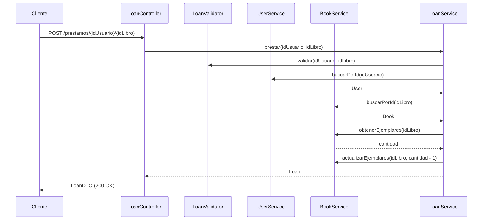

# DOSW-Library

Sistema de gestión de biblioteca desarrollado con Spring Boot y Maven. Permite registrar usuarios, agregar libros con sus ejemplares disponibles, realizar préstamos y registrar devoluciones.

## Configuración del Proyecto

- **GroupId**: edu.eci.dosw
- **ArtifactId**: DOSW-Library
- **Java**: 17
- **Spring Boot**: 3.2.0

## Dependencias

- Spring Boot Starter Web
- Spring Boot Starter Test (JUnit 5)
- Springdoc OpenAPI (Swagger UI)
- JaCoCo
- SonarQube

---

## Diagrama General

El sistema está organizado en capas. El cliente envía peticiones HTTP que llegan a los controladores. Cada controlador delega la lógica de negocio al servicio correspondiente. Los servicios validan los datos de entrada usando los validadores antes de operar sobre los modelos. Los controladores usan los mappers para convertir entre los modelos internos y los DTOs que se exponen al cliente.



---

## Diagrama Específico

Este diagrama muestra paso a paso el flujo de un préstamo. El cliente hace una petición POST al `LoanController`, que llama a `LoanService`. El servicio primero valida los IDs con `LoanValidator`, luego busca el usuario en `UserService` y el libro en `BookService`. Verifica que haya ejemplares disponibles y que el usuario no supere el límite de 3 préstamos activos. Si todo es válido, descuenta un ejemplar y registra el préstamo, devolviendo un `LoanDTO` al cliente.



---

## Diagrama de Clases

Muestra todas las clases del sistema con sus atributos, métodos y relaciones. `Loan` es la clase central ya que asocia un `Book` con un `User` y lleva el estado del préstamo (`LoanStatus`). Los servicios gestionan las colecciones de cada entidad y usan sus respectivos validadores para verificar los datos antes de operar. Los controladores reciben las peticiones HTTP y delegan al servicio correspondiente.


---

## Ejecución de pruebas

```bash
mvn test
```

## Cobertura con JaCoCo

```bash
mvn test jacoco:report
```

El reporte se genera en `target/site/jacoco/index.html`.

---

## Análisis estático con SonarCloud

Resultado del análisis estático del proyecto en SonarCloud.


## Evidencia de pruebas

### Pruebas unitarias


### Cobertura JaCoCo


---

## Evidencia de pruebas funcionales

### Agregar libro


### Agregar usuario


### Obtener todos los libros


### Prestar libro


### Devolver libro

