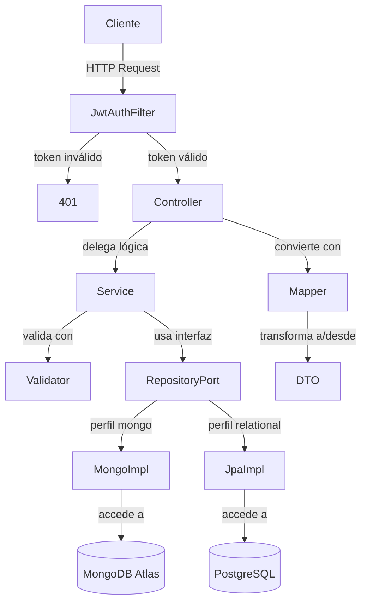
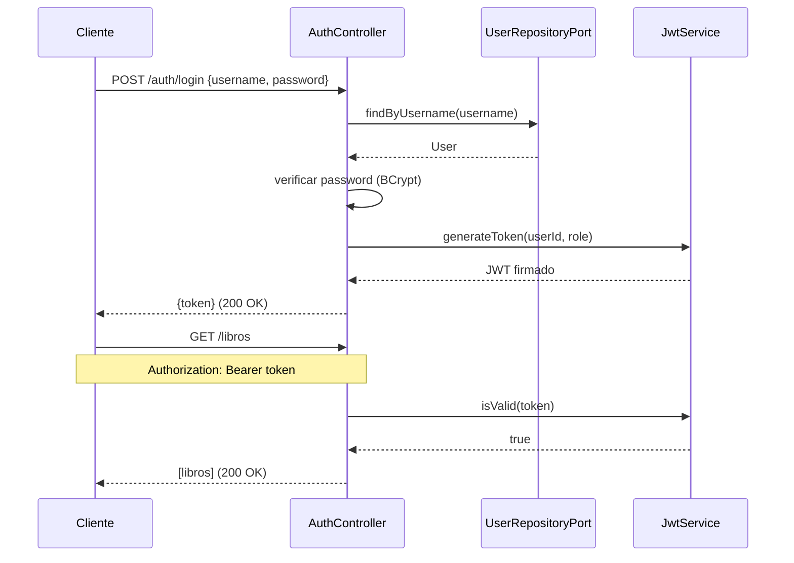
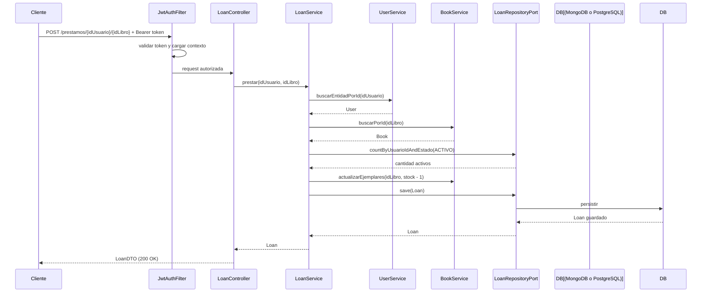
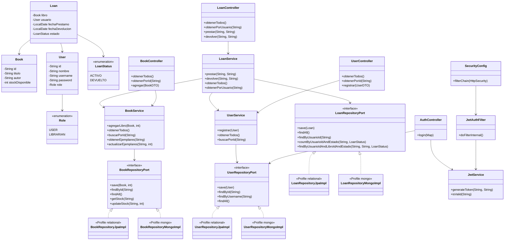
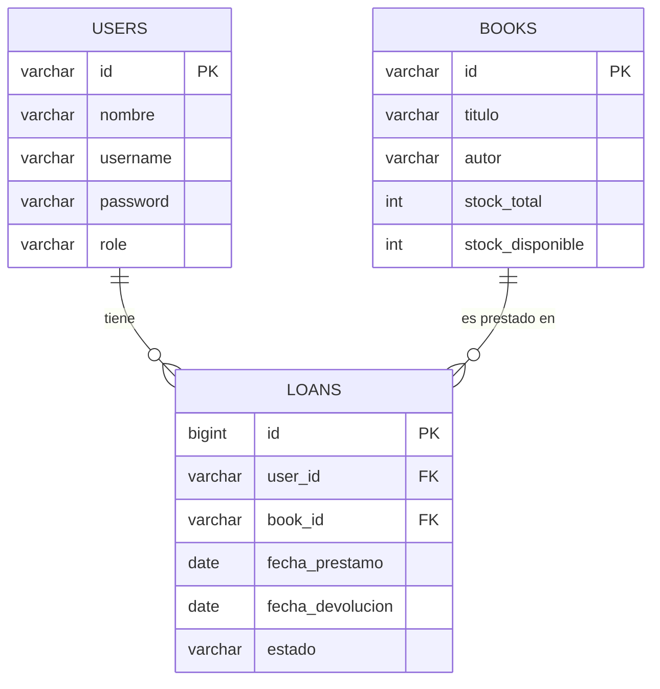

# DOSW-Library

Sistema de gestión de biblioteca desarrollado con Spring Boot y Maven. Permite registrar usuarios, agregar libros con inventario, realizar préstamos y registrar devoluciones. Incluye persistencia en PostgreSQL y seguridad basada en JWT con roles.

---

## Diagrama General

el cliente manda peticiones HTTP que pasan por el filtro JWT. si el token es válido llega al controlador, que delega al servicio. el servicio valida, opera sobre el modelo de dominio y persiste a través de una interfaz de repositorio. según el perfil activo (`mongo` o `relational`), Spring inyecta la implementación correspondiente.



---

## Diagrama de Autenticación

el cliente manda sus credenciales al endpoint de login. el sistema las valida contra la base de datos activa (MongoDB o PostgreSQL según el perfil), genera un JWT firmado y el cliente lo usa en cada request siguiente.



---

## Diagrama Específico

el cliente manda el token JWT, el filtro lo valida. el `LoanController` delega al `LoanService`, que valida los ids, busca los modelos de dominio, verifica disponibilidad y límite, actualiza el stock y persiste el préstamo a través de la interfaz `LoanRepositoryPort`.



---

## Diagrama de Clases

el sistema tiene modelos de dominio (`Book`, `User`, `Loan`) que usan los servicios. las interfaces de repositorio (`BookRepositoryPort`, `UserRepositoryPort`, `LoanRepositoryPort`) desacoplan los servicios de la persistencia. según el perfil activo, Spring inyecta la implementación JPA o MongoDB.



---

## Diagrama Entidad-Relación

la base de datos tiene tres tablas. `users` guarda los datos del usuario incluyendo credenciales y rol. `books` guarda el libro con su stock total y disponible. `loans` conecta un usuario con un libro y guarda el estado del préstamo.



---

## Modelo No Relacional (MongoDB)

el modelo NoSQL usa tres colecciones. `books` y `users` son documentos independientes con toda su información embebida. `loans` referencia a ambos por id y embebe el historial de cambios de estado directamente dentro del documento del préstamo.

### Decisiones de diseño

- `metadata`, `disponibilidad` y `categorias` se **embeben** en `books` porque son datos propios del libro, siempre se leen juntos y no se comparten con otros documentos.
- `historial` se **embebe** en `loans` porque es exclusivo de ese préstamo y crece de forma acotada (pocos cambios de estado por préstamo).
- `usuario` y `libro` en `loans` se **referencian** por id porque son entidades independientes que pueden consultarse y modificarse por separado.

### Colección: books

```json
{
  "_id": "isbn-001",
  "titulo": "Clean Code",
  "autor": "Robert C. Martin",
  "isbn": "978-0132350884",
  "tipoPublicacion": "ebook",
  "fechaPublicacion": "2008-08-01",
  "fechaAgregado": "2024-01-15",
  "categorias": ["programacion", "buenas practicas"],
  "metadata": {
    "paginas": 431,
    "idioma": "ingles",
    "editorial": "Prentice Hall"
  },
  "disponibilidad": {
    "status": "DISPONIBLE",
    "totalCopias": 5,
    "copiasDisponibles": 3,
    "copiasPrestadas": 2
  }
}
```

### Colección: users

```json
{
  "_id": "u-001",
  "nombre": "Juan Perez",
  "username": "jperez",
  "password": "$2a$10$...",
  "email": "jperez@mail.com",
  "role": "USER",
  "membresia": "PLATINUM",
  "fechaRegistro": "2024-03-10"
}
```

### Colección: loans

```json
{
  "_id": "loan-001",
  "usuarioId": "u-001",
  "libroId": "isbn-001",
  "fechaPrestamo": "2024-11-01",
  "fechaDevolucion": "2024-11-15",
  "estado": "DEVUELTO",
  "historial": [
    { "status": "ACTIVO",    "fecha": "2024-11-01" },
    { "status": "DEVUELTO",  "fecha": "2024-11-15" }
  ]
}
```

---

## Evidencia Parte 3 - Hackathon

### Video pruebas funcionales con Swagger (Reto 5)
https://youtu.be/Sx4snV0t0pA

### Video persistencia en MongoDB (Reto 5)
https://youtu.be/azH0CyXqULU

---

## Evidencia workflow 


---


## Análisis estático con SonarCloud

Resultado del análisis estático del proyecto en SonarCloud.


## Evidencia de pruebas

### Pruebas unitarias


### Cobertura JaCoCo


### video funcionamiento seguridad

https://youtu.be/g_eFTXSoLVs


---

## Evidencia de pruebas funcionales

### Agregar libro


### Agregar usuario


### Obtener todos los libros


### Prestar libro


### Devolver libro

