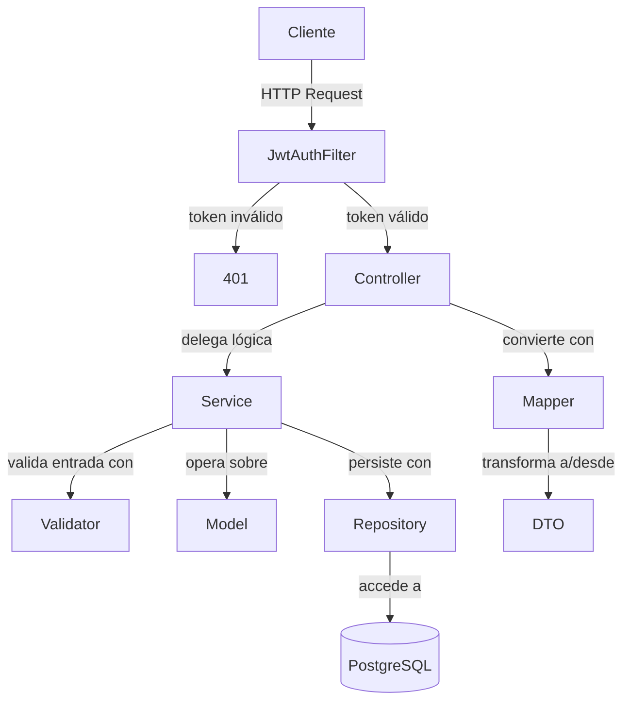
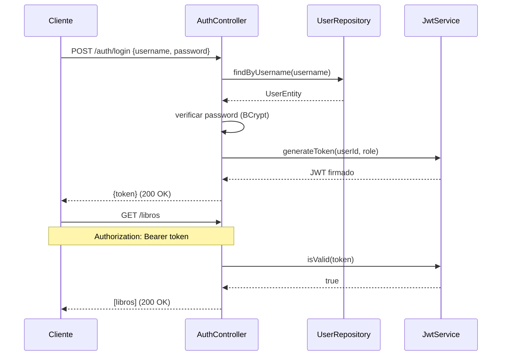
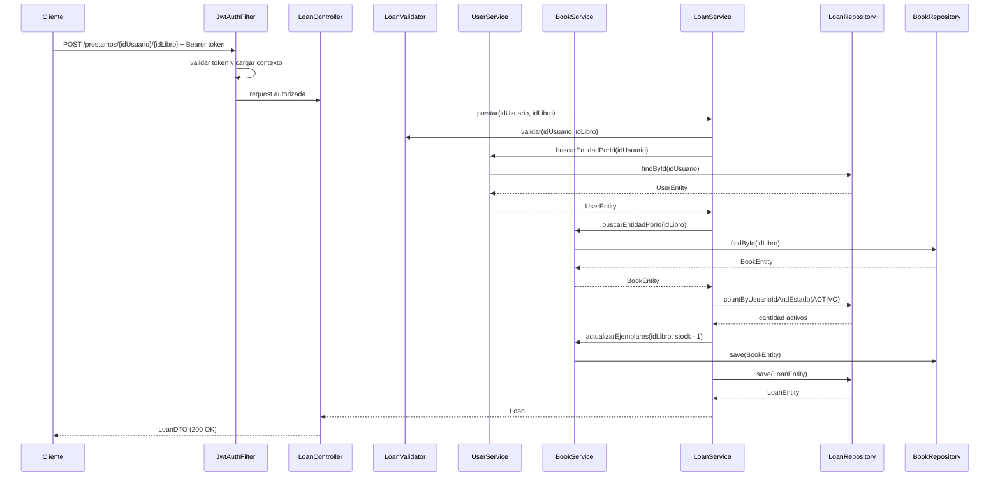
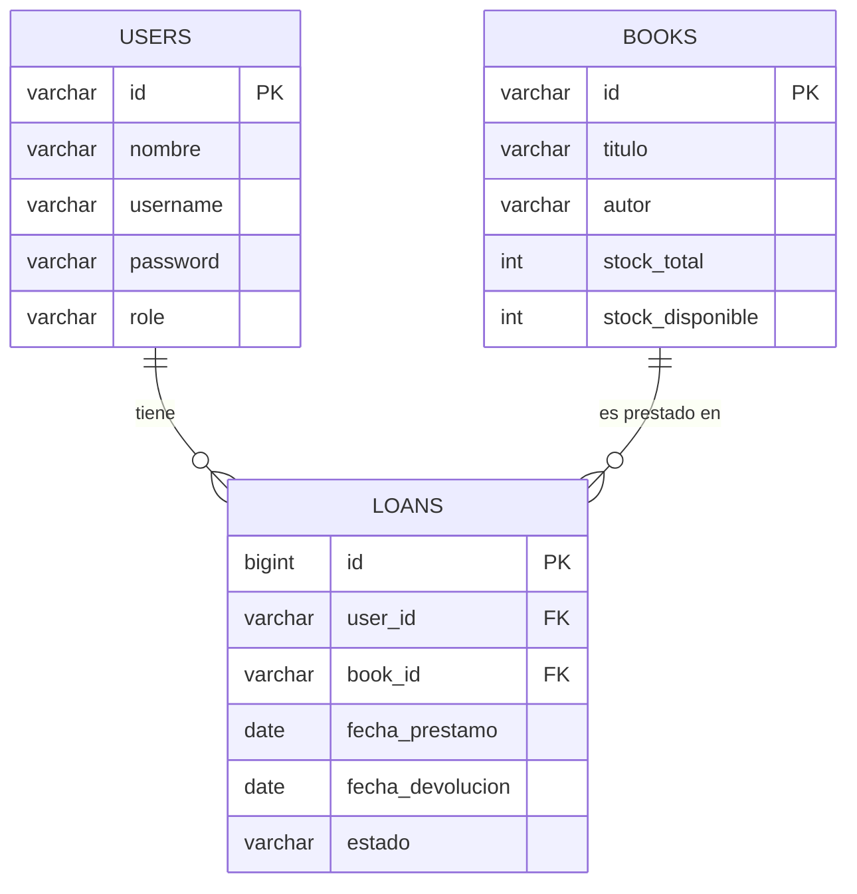
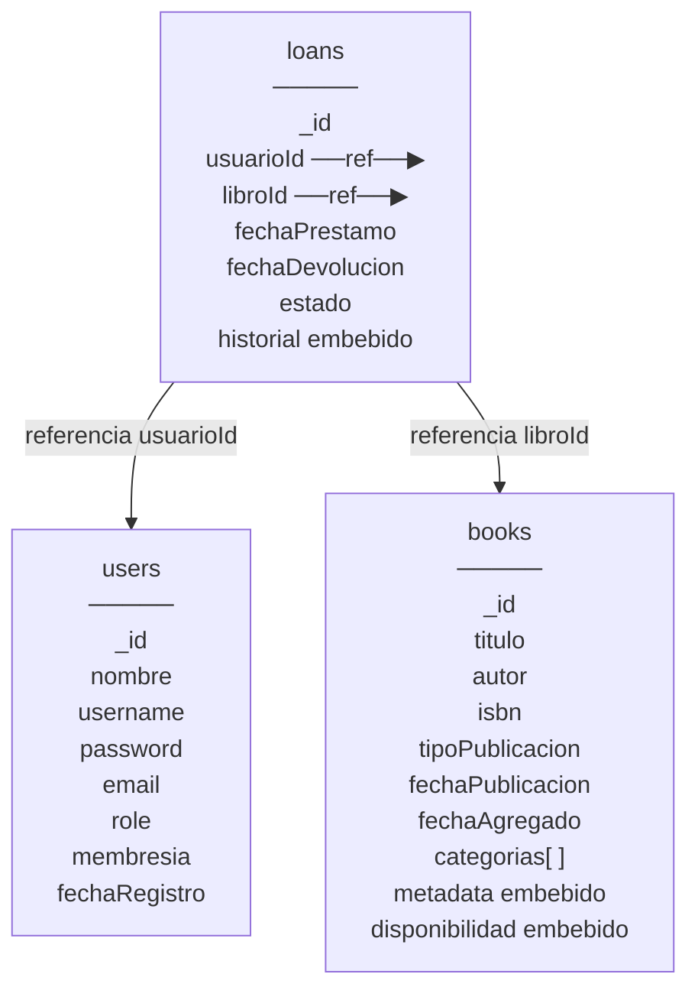

# DOSW-Library

Sistema de gestión de biblioteca desarrollado con Spring Boot y Maven. Permite registrar usuarios, agregar libros con inventario, realizar préstamos y registrar devoluciones. Incluye persistencia en PostgreSQL y seguridad basada en JWT con roles.

---

## Diagrama General

el sistema se divide en capas. el cliente manda peticiones HTTP que primero pasan por el filtro JWT. si el token es válido, la request llega al controlador correspondiente. cada controlador le pasa el trabajo al servicio. los servicios usan los validadores para revisar los datos, luego operan sobre los modelos de dominio y persisten los cambios a través de los repositorios JPA. los controladores usan los mappers para convertir entre modelos y DTOs.



---

## Diagrama de Autenticación

el cliente manda sus credenciales al endpoint de login. el sistema las valida contra la base de datos, y si son correctas genera un JWT firmado con el id del usuario y su rol. el cliente usa ese token en cada request siguiente en el header Authorization.



---

## Diagrama Específico

aca se ve paso a paso como funciona un prestamo con persistencia. el cliente manda el token JWT, el filtro lo valida y carga el usuario en el contexto de seguridad. el `LoanController` delega al `LoanService`, que valida los ids, busca las entidades en la base de datos, verifica disponibilidad y límite de préstamos, actualiza el stock y persiste el préstamo.



---

## Diagrama de Clases

el sistema tiene dos capas de modelo: los modelos de dominio (`Book`, `User`, `Loan`) que usan los servicios internamente, y las entidades JPA (`BookEntity`, `UserEntity`, `LoanEntity`) que se persisten en la base de datos. `UserEntity` ahora incluye `username`, `password` y `role`. la capa de seguridad tiene `JwtService` para generar y validar tokens, `JwtAuthFilter` que intercepta cada request, y `SecurityConfig` que define las reglas de acceso.

```mermaid
classDiagram
    class Book {
        -String id
        -String titulo
        -String autor
    }

    class User {
        -String id
        -String nombre
        -String username
        -String password
        -Role role
    }

    class Loan {
        -Book libro
        -User usuario
        -LocalDate fechaPrestamo
        -LocalDate fechaDevolucion
        -LoanStatus estado
    }

    class LoanStatus {
        <<enumeration>>
        ACTIVO
        DEVUELTO
    }

    class BookEntity {
        -String id
        -String titulo
        -String autor
        -int stockTotal
        -int stockDisponible
    }

    class UserEntity {
        -String id
        -String nombre
        -String username
        -String password
        -Role role
    }

    class Role {
        <<enumeration>>
        USER
        LIBRARIAN
    }

    class LoanEntity {
        -Long id
        -BookEntity libro
        -UserEntity usuario
        -LocalDate fechaPrestamo
        -LocalDate fechaDevolucion
        -LoanStatus estado
    }

    class BookRepository {
        +findById(String)
        +findAll()
        +save(BookEntity)
    }

    class UserRepository {
        +findById(String)
        +findByUsername(String)
        +save(UserEntity)
    }

    class LoanRepository {
        +findByUsuarioId(String)
        +countByUsuarioIdAndEstado(String, LoanStatus)
        +findByUsuarioIdAndLibroIdAndEstado(String, String, LoanStatus)
        +save(LoanEntity)
    }

    class BookService {
        +agregarLibro(Book, int)
        +obtenerTodos()
        +buscarPorId(String)
        +obtenerEjemplares(String)
        +actualizarEjemplares(String, int)
        +buscarEntidadPorId(String)
    }

    class UserService {
        +registrar(User)
        +obtenerTodos()
        +buscarPorId(String)
        +buscarEntidadPorId(String)
    }

    class LoanService {
        +prestar(String, String)
        +devolver(String, String)
        +obtenerTodos()
        +obtenerPorUsuario(String)
    }

    class JwtService {
        +generateToken(String, String)
        +extractUserId(String)
        +extractRole(String)
        +isValid(String)
    }

    class JwtAuthFilter {
        +doFilterInternal()
    }

    class SecurityConfig {
        +filterChain(HttpSecurity)
        +passwordEncoder()
    }

    class AuthController {
        +login(Map)
    }

    class BookController {
        +obtenerTodos()
        +obtenerPorId(String)
        +agregar(BookDTO)
    }

    class UserController {
        +obtenerTodos()
        +obtenerPorId(String)
        +registrar(UserDTO)
    }

    class LoanController {
        +obtenerTodos()
        +obtenerPorUsuario(String)
        +prestar(String, String)
        +devolver(String, String)
    }

    class BookValidator {
        +validar(Book)
    }

    class UserValidator {
        +validar(String, String)
    }

    class LoanValidator {
        +validar(String, String)
    }

    Loan --> Book
    Loan --> User
    Loan --> LoanStatus
    LoanEntity --> BookEntity
    LoanEntity --> UserEntity
    LoanEntity --> LoanStatus
    UserEntity --> Role
    BookService --> BookRepository
    BookService --> BookValidator
    UserService --> UserRepository
    UserService --> UserValidator
    LoanService --> LoanRepository
    LoanService --> BookService
    LoanService --> UserService
    LoanService --> LoanValidator
    BookController --> BookService
    UserController --> UserService
    LoanController --> LoanService
    AuthController --> UserRepository
    AuthController --> JwtService
    JwtAuthFilter --> JwtService
    SecurityConfig --> JwtAuthFilter
```



---

## Diagrama Entidad-Relación

la base de datos tiene tres tablas. `users` guarda los datos del usuario incluyendo credenciales y rol. `books` guarda el libro con su stock total y disponible. `loans` conecta un usuario con un libro y guarda el estado del préstamo.



---

## Modelo No Relacional (MongoDB)

el modelo NoSQL usa tres colecciones. `books` y `users` son documentos independientes con toda su información embebida. `loans` referencia a ambos por id y embebe el historial de cambios de estado directamente dentro del documento del préstamo.

### Decisiones de diseño

- `metadata`, `disponibilidad` y `categorias` se **embeben** en `books` porque son datos propios del libro, siempre se leen juntos y no se comparten con otros documentos.
- `historial` se **embebe** en `loans` porque es exclusivo de ese préstamo y crece de forma acotada (pocos cambios de estado por préstamo).
- `usuario` y `libro` en `loans` se **referencian** por id porque son entidades independientes que pueden consultarse y modificarse por separado.

### Colección: books

```json
{
  "_id": "isbn-001",
  "titulo": "Clean Code",
  "autor": "Robert C. Martin",
  "isbn": "978-0132350884",
  "tipoPublicacion": "ebook",
  "fechaPublicacion": "2008-08-01",
  "fechaAgregado": "2024-01-15",
  "categorias": ["programacion", "buenas practicas"],
  "metadata": {
    "paginas": 431,
    "idioma": "ingles",
    "editorial": "Prentice Hall"
  },
  "disponibilidad": {
    "status": "DISPONIBLE",
    "totalCopias": 5,
    "copiasDisponibles": 3,
    "copiasPrestadas": 2
  }
}
```

### Colección: users

```json
{
  "_id": "u-001",
  "nombre": "Juan Perez",
  "username": "jperez",
  "password": "$2a$10$...",
  "email": "jperez@mail.com",
  "role": "USER",
  "membresia": "PLATINUM",
  "fechaRegistro": "2024-03-10"
}
```

### Colección: loans

```json
{
  "_id": "loan-001",
  "usuarioId": "u-001",
  "libroId": "isbn-001",
  "fechaPrestamo": "2024-11-01",
  "fechaDevolucion": "2024-11-15",
  "estado": "DEVUELTO",
  "historial": [
    { "status": "ACTIVO",    "fecha": "2024-11-01" },
    { "status": "DEVUELTO",  "fecha": "2024-11-15" }
  ]
}
```

### Diagrama de colecciones



---

## Análisis estático con SonarCloud

Resultado del análisis estático del proyecto en SonarCloud.


## Evidencia de pruebas

### Pruebas unitarias


### Cobertura JaCoCo


---

## Evidencia de pruebas funcionales

### Agregar libro


### Agregar usuario


### Obtener todos los libros


### Prestar libro


### Devolver libro

