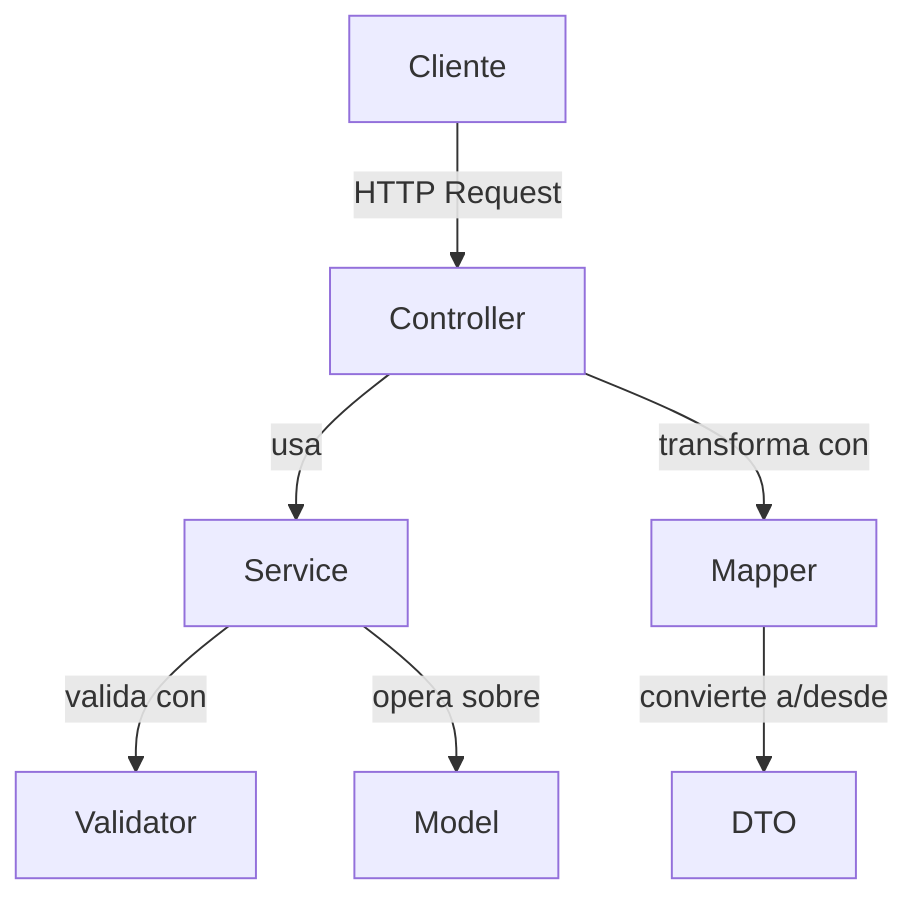
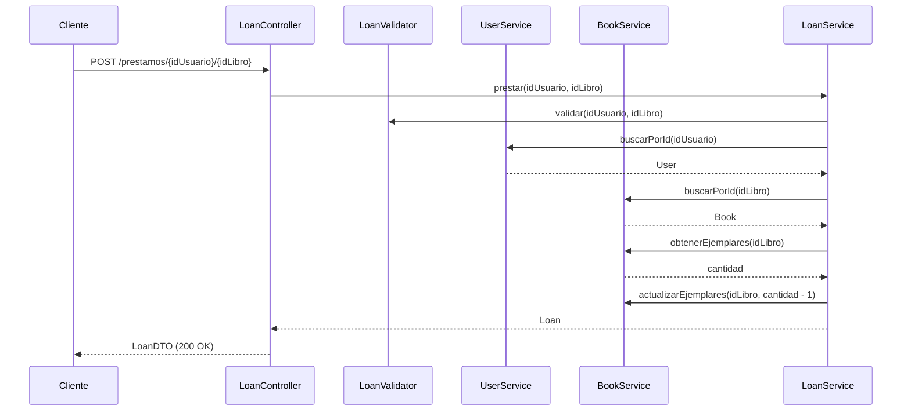
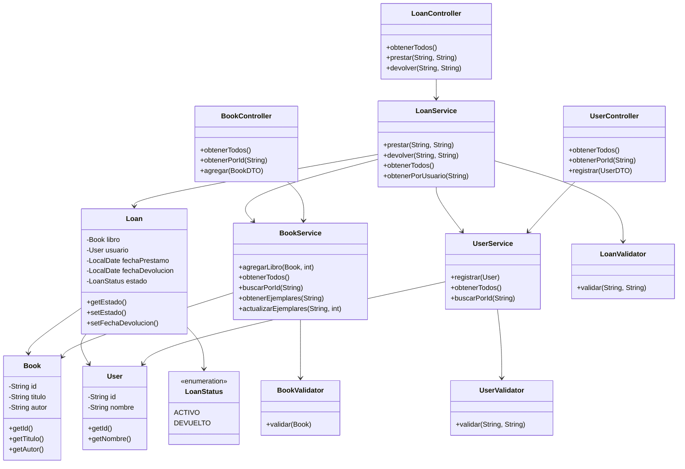

# DOSW-Library

Sistema de gestión de biblioteca desarrollado con Spring Boot y Maven. Permite registrar usuarios, agregar libros con sus ejemplares disponibles, realizar préstamos y registrar devoluciones.

## Configuración del Proyecto

- **GroupId**: edu.eci.dosw
- **ArtifactId**: DOSW-Library
- **Java**: 17
- **Spring Boot**: 3.2.0

## Dependencias

- Spring Boot Starter Web
- Spring Boot Starter Test (JUnit 5)
- Springdoc OpenAPI (Swagger UI)
- JaCoCo
- SonarQube

---

## Diagrama General

Muestra cómo interactúan las capas principales del sistema. El cliente hace peticiones HTTP a los controladores, estos delegan la lógica a los servicios, y los servicios usan los modelos para representar los datos.



---

## Diagrama Específico

Muestra el flujo completo de un préstamo: desde que el cliente llama al endpoint hasta que se registra el préstamo y se actualiza el stock de ejemplares.



---

## Diagrama de Clases

Muestra las clases del sistema, sus atributos, métodos y relaciones entre ellas.



---

## Endpoints de la API

### Libros
| Método | Endpoint | Descripción |
|--------|----------|-------------|
| GET | `/libros` | Obtener todos los libros |
| GET | `/libros/{id}` | Buscar libro por ID |
| POST | `/libros` | Agregar un libro |

Body POST:
```json
{
  "id": "lib-001",
  "titulo": "Clean Code",
  "autor": "Martin",
  "copies": 3
}
```

### Usuarios
| Método | Endpoint | Descripción |
|--------|----------|-------------|
| GET | `/usuarios` | Obtener todos los usuarios |
| GET | `/usuarios/{id}` | Buscar usuario por ID |
| POST | `/usuarios` | Registrar un usuario |

Body POST:
```json
{
  "id": "usr-001",
  "nombre": "Nico"
}
```

### Préstamos
| Método | Endpoint | Descripción |
|--------|----------|-------------|
| GET | `/prestamos` | Obtener todos los préstamos |
| POST | `/prestamos/{idUsuario}/{idLibro}` | Realizar un préstamo |
| PUT | `/prestamos/devolver/{idUsuario}/{idLibro}` | Devolver un libro |

---

## Documentación Swagger

Con la aplicación corriendo, acceder a:

```
http://localhost:8080/swagger-ui.html
```

---

## Ejecución de pruebas

```bash
mvn test
```

## Cobertura con JaCoCo

```bash
mvn test jacoco:report
```

El reporte se genera en `target/site/jacoco/index.html`.

---

## Análisis estático con SonarCloud

Resultado del análisis estático del proyecto en SonarCloud.


## Evidencia de pruebas

### Pruebas unitarias


### Cobertura JaCoCo


---

## Evidencia de pruebas funcionales

### Agregar libro


### Agregar usuario


### Obtener todos los libros


### Prestar libro


### Devolver libro

